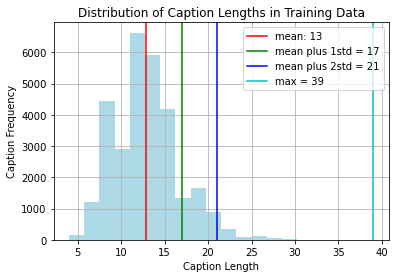
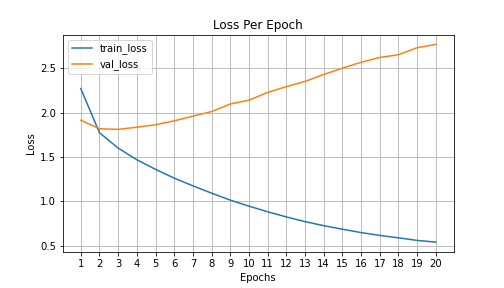

# Image Captions Generator

Generate captions from images 
{readme update work in progress, keep tuning in!}

## Table Of Contents

1. [Background](#1-background)
    * 1.1. [Why caption images](#11-why-caption-images)
    * 1.2. [Model architecture](#12-model-architecture)
    * 1.3. [Why use attention](#13-why-use-attention)
2. [How to use this repository](#2-how-to-use-this-repository)
    * 2.1. [Requirements](#21-requirements)
    * 2.2. [Configure settings](#22-configure-settings)
    * 2.3. Create
    * 2.4. Training
    * 2.5. Inference 
3. Results
4. Inferences
5. References

## 1. Background

### 1.1. Why caption images

Image captions serve as a link between the image and the text. It helps AI algortihms to make better sense of what's going on in the image. Can be useful for Seach Engine Optimization (SEO), indexing and archiving photos based on its contents such as actions / places / objects in it (similar to what Google Photos does today). Image captioning can also help to process videographic data by identifying what's happening frame by frame.

### 1.2. Model architecture

Here we are using an attention based encoder-decooder model to generate captions. Training images available in RBG format are passed through a pre-trained encoder model to obtain spatial information from images, which are then passed through a decoder block to generate the captions sequentially. Encoder is most oftenly a pre-trained CNN model and decoder is a RNN model. 

### 1.3. Why use attention ?

Attention in literal English means directing focus at something or taking greater notice. In Deep Learning, attention mechanism lives off the same concept where a model pays higher focus on certain factors while processing the data. Attention in an encoder-decoder model is in charge of managing and quantifying the dependence that the decoder has on the encoder.

## 2. How to use this repository

### 2.1. Requirements

* Create a conda environment using following command: 
`conda create --name <_yourenvname_> python=3.7`
In case you are not familiar with conda environments, refer to [[1]](#1-getting-started-with-python-environments-using-conda) and [[2]](#2-create-virtual-environments-for-python-with-conda) to get started.

* Install dependencies using [requirements.txt](requirements.txt) 
`pip3 install -r requirements.txt`

* Flickr8k images have been used in this project. There are multiple sources available online to download this dataset, here is one of them - [download flickr8k](https://www.kaggle.com/adityajn105/flickr8k).

* Instead of creating the train-test-val split by ourselves, we'll leverage the awesome work done by Andrej Karpathy to split the images into train-val-test in ratio  6000:1000:1000 alongwith segregating their captions. This is available as json, download from [here](https://www.kaggle.com/shtvkumar/karpathy-splits?select=dataset_flickr8k.json).
    
### 2.2. Configure settings

Specify following settings in [config.yaml](config/config.yaml). These are used as hyperparameters to train the model. 

* **epochs** Number of cycles where all training data is passed through the model exactly once. A forward pass and a backward pass together are counted as one pass 
* **batch_size:** An epoch is made up of one or more batches, where we use a part of the dataset to train the neural network. Training data is split into batch_size and model weights are updated once per batch 
* **units:** Number of units in the decoder RNN 
* **embedding_dim:** 
* **vocab_size:** 

### 2.3. Training and Inference

* In the preprocessing step, tensorflow.keras.preprocessing.pad_sequences is used to standardize the length of all training captions, we have set max_len parameter of pad_sequences to 21 , which is equal to {average(training captions) + 2 standard deviation(training captions)}. Keeping max_len = 39 (longest caption in train) leads to spurious results where the algorithm lurks between random words until max_len is reached. 

Also, I figured that only 2.2% training captions are longer than 21 words, so it does not make sense to train for full size.

    

* Run [img_features.py](img_features.py) to save the encoded version of images into the disk. This usually takes 30-35 mins for images in train and validation set, so better to perform this step one-off before kicking off training. Saving to disk would save us from encoding images repeatedly as we try different combinations of model settings.

* At this point, we are ready with all settings to begin the model training. Kick-off training by running [main.py](main.py).

* At the end of training, we compute BLEU scores for both training and validation set, using two methods to generate predicted captions: Greedy Search and Beam Search

* Here are the losses per epoch for training and validation sets. While the training loss decreases as training progresses, there is a hint of overfitting as the validation loss increases after an initial dip.

    

## 3. Results

| # 	| max_len 	|                      Model Setting                      	|                                               Greedy Search                                              	|                                             Beam Search (k=3)                                            	|
|---	|---------	|:-------------------------------------------------------:	|:--------------------------------------------------------------------------------------------------------:	|:--------------------------------------------------------------------------------------------------------:	|
| 1 	| 39      	| Epochs: 40 RNN Units: 256 Vocab size: Full (7378) 	| Dev set BLEU scores:  - BLEU-1: 0.4044 - BLEU-2: 0.2131 - BLEU-3: 0.0792 - BLEU-4: 0.0234 	| Dev set BLEU scores:  - BLEU-1: 0.4259 - BLEU-2: 0.2284 - BLEU-3: 0.0962 - BLEU-4: 0.0358 	|
| 2 	| 39      	| Epochs: 20 RNN Units: 512 Vocab size: Full (7378) 	| Dev set BLEU scores:  - BLEU-1: 0.4548 - BLEU-2: 0.2560 - BLEU-3: 0.1183 - BLEU-4: 0.0400 	| Dev set BLEU scores:  - BLEU-1: 0.4547 - BLEU-2: 0.2711 - BLEU-3: 0.1301 - BLEU-4: 0.0466 	|
| 3 	| 39      	| Epochs: 40 RNN Units: 512 Vocab size: 6000        	| Dev set BLEU scores:  - BLEU-1: 0.4280 - BLEU-2: 0.2275 - BLEU-3: 0.0823 - BLEU-4: 0.0241 	| Dev set BLEU scores:  - BLEU-1: 0.4255 - BLEU-2: 0.2261 - BLEU-3: 0.0888 - BLEU-4: 0.0290 	|
| 4 	| 39      	| Epochs: 20 RNN Units: 512 Vocab size: 6000        	| Dev set BLEU scores:  - BLEU-1: 0.4531 - BLEU-2: 0.2581 - BLEU-3: 0.1022 - BLEU-4: 0.0326 	| Dev set BLEU scores:  - BLEU-1: 0.4620 - BLEU-2: 0.2646 - BLEU-3: 0.1157 - BLEU-4: 0.0393 	|
| 5 	| 21      	| Epochs: 20 RNN Units: 512 Vocab size: 7377        	| Dev set BLEU scores:  - BLEU-1: 0.4604 - BLEU-2: 0.2597 - BLEU-3: 0.1083 - BLEU-4: 0.0405 	| Dev set BLEU scores:  - BLEU-1: 0.4647 - BLEU-2: 0.2724 - BLEU-3: 0.1169 - BLEU-4: 0.0452 	|
| 6 	| 21      	| Epochs: 20 RNN Units: 512 Vocab size: 6000        	| Dev set BLEU scores:  - BLEU-1: 0.4648 - BLEU-2: 0.2649 - BLEU-3: 0.1109 - BLEU-4: 0.0373 	| Dev set BLEU scores:  - BLEU-1: 0.4732 - BLEU-2: 0.2731 - BLEU-3: 0.1258 - BLEU-4: 0.0447 	|
| 7 	| 21      	| Epochs: 20 RNN Units: 256 Vocab Size:             	| Dev set BLEU scores:  - BLEU-1: 0.4601 - BLEU-2: 0.2577 - BLEU-3: 0.1014 - BLEU-4: 0.0319 	| Dev set BLEU scores:  - BLEU-1: 0.4726 - BLEU-2: 0.2680 - BLEU-3: 0.1161 - BLEU-4: 0.0386 	|
| 8 	| 21      	| Epochs: 20 RNN Units: 512 Vocab Size: 7378        	| Dev set BLEU scores:  - BLEU-1: 0.4745 - BLEU-2: 0.2776 - BLEU-3: 0.1219 - BLEU-4: 0.0398 	| Dev set BLEU scores:  - BLEU-1: 0.4855 - BLEU-2: 0.2900 - BLEU-3: 0.1359 - BLEU-4: 0.0523 	|
| 9 	| 17      	| Epochs: 20 RNN Units: 512 Vocab Size: 7378        	| Dev set BLEU scores:  - BLEU-1: 0.4706 - BLEU-2: 0.2678 - BLEU-3: 0.1114 - BLEU-4: 0.0339 	| Dev set BLEU scores:  - BLEU-1: 0.4776 - BLEU-2: 0.2739 - BLEU-3: 0.1232 - BLEU-4: 0.0412 	|

* Here is how the model learnt captions for a sample image shown below:

| Image 	|                                                                                                                                                                                                                                                                                                                                                                                Intermediate Predicted Caption at each Epoch                                                                                                                                                                                                                                                                                                                                                                                	|
|:-----:	|:----------------------------------------------------------------------------------------------------------------------------------------------------------------------------------------------------------------------------------------------------------------------------------------------------------------------------------------------------------------------------------------------------------------------------------------------------------------------------------------------------------------------------------------------------------------------------------------------------------------------------------------------------------------------------------------------------------------------------------------------------------------------------------------------------------	|
|      	| 1,a man on a bike on the street 2,a man on a bicycle 3,a man is riding a bicycle 4,a man is riding a bicycle down a street 5,a man on a bicycle 6,a man walks along a dirt road 7,a man is riding a bicycle down a road 8,a bicycle on a dirt bike 9,a man is driving a bicycle down a road 10,a man is riding a bicycle on a road 11,a man is riding his bike 12,a bicycle on a bicycle down a street 13,a bicycle wheel on a gravel road 14,a bicycle wheel bikes on a dirt road 15,a bicycle on a dirt road 16,a man is riding his bike covered road in a race 17,a man bicycle wheel 18,a bicycle wheel a bicycle moving down a curved pipe wall 19,a bicyclist on a curved road in the background 20,a man is riding a bicycle down a street 	|
|       	|                                                                                                                                                                                                                                                                                                                                                                                                                                                                                                                                                              
## 5. Inferences
* Training on a larger corpus of images could potentially improve performance. Since I have used Google Colab for training and there is a cap on Google Drive storage limit, I have used Flickr8k dataset, but we could upgrade to Flickr30k or COCO dataset for access to more training samples.

* Training for higher epochs cause the model to overfit on the training set. We have incorporated regularization techniques like L2 regularizer and Dropout but they do not seem to help after a certain degree.

* BLEU scores are better while using Beam Search as compared to Greedy Search. Increasing the beam width (currently 3) can further improve the performance marginally. However, considering more beam samples at every step would mean higher computation expense.

* Increasing the number of units in RNN Decoder helps in better performance.

## 5. References

### [1. Getting started with Python environments using Conda](https://towardsdatascience.com/getting-started-with-python-environments-using-conda-32e9f2779307)
### [2. Create virtual environments for python with conda](https://uoa-eresearch.github.io/eresearch-cookbook/recipe/2014/11/20/conda/)

